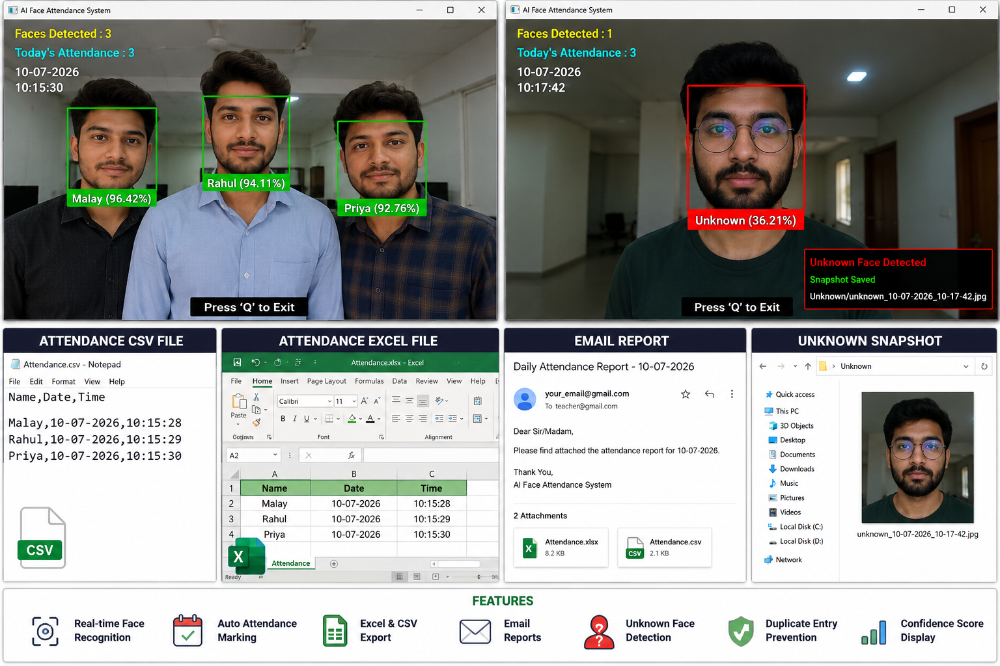
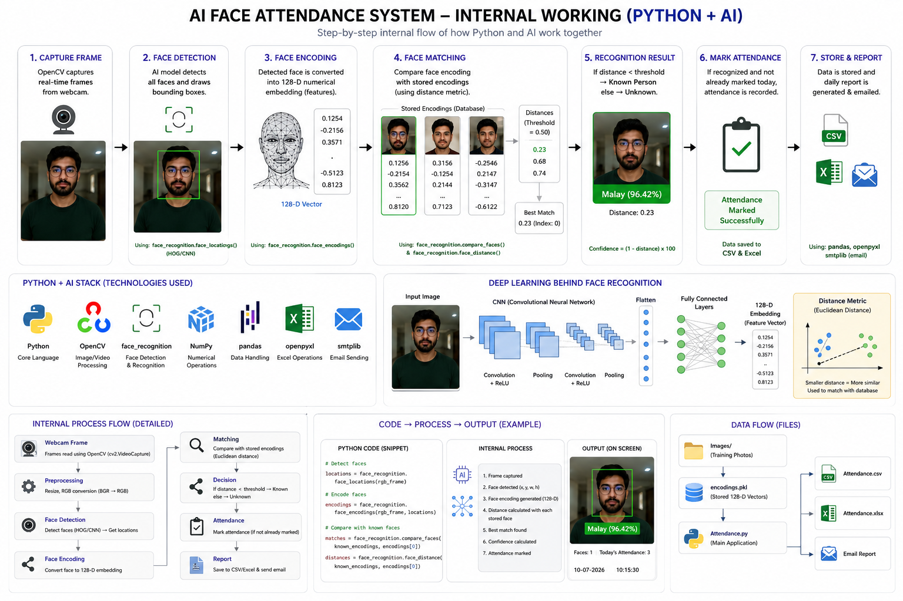
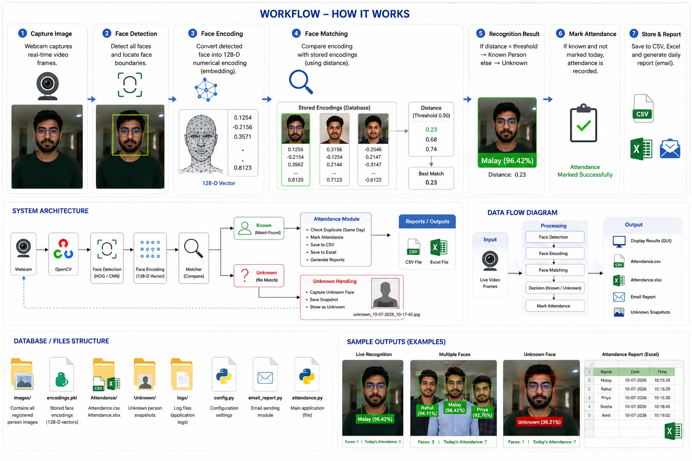

# face_attendance_system
#  AI Face Attendance System

An intelligent Face Recognition Attendance System built using **Python**, **OpenCV**, and **face_recognition** that automatically detects and recognizes faces through a webcam, marks attendance, exports reports to Excel, and supports email notifications.

---

##  Demo

<p align="center">
  
</p>

<p align="center">
  
</p>

<p align="center">
  
</p>

> Coming Soon

---

##  Features

-  Real-time Face Detection
-  Face Recognition using AI
-  Multiple Face Detection
-  Known Face Identification
-  Unknown Face Detection
-  Automatic Attendance Marking
-  Date & Time Logging
-  Duplicate Attendance Prevention
-  CSV Export
-  Excel (.xlsx) Export
-  Email Attendance Report
-  Automatic Attendance Folder Creation
-  Fast Face Encoding using Pickle Cache
-  Confidence Score Display
-  Clean OpenCV Interface

---

#  Project Architecture

```
                Webcam
                   │
                   ▼
          OpenCV Video Stream
                   │
                   ▼
          Face Detection Engine
                   │
                   ▼
       Face Recognition Model
                   │
        ┌──────────┴──────────┐
        ▼                     ▼
   Known Person          Unknown Person
        │                     │
        ▼                     ▼
 Mark Attendance        Ignore / Save
        │
        ▼
 Attendance CSV / Excel
        │
        ▼
 Email Report
```

---

#  Project Structure

```
AI-Face-Attendance-System/

│
├── images/
│      person1.jpg
│      person2.jpg
│
├── Attendance/
│      Attendance.csv
│      Attendance.xlsx
│
├── lbph_model.yml
├── labels.pkl
│
├── encode_faces.py
├── attendance.py
├── email_report.py
├── requirements.txt
├── README.md
└── LICENSE
```

---

#  Tech Stack

| Technology | Purpose |
|------------|----------|
| Python | Programming Language |
| OpenCV | Computer Vision |
| NumPy | Numerical Operations |
| Pandas | Attendance Management |
| OpenPyXL | Excel Export |
| Pickle | Face Encoding Cache |
| SMTP | Email Automation |

---

#  Installation

Clone the repository

```bash
git clone https://github.com/yourusername/AI-Face-Attendance-System.git
```

Move into the project

```bash
cd AI-Face-Attendance-System
```

Install dependencies

```bash
pip install -r requirements.txt
```

> Note: This project is tested with Python 3.11 and 3.12 on Windows.
> If you are using Python 3.14, install Python 3.11 or 3.12 and recreate the virtual environment.

---

#  Usage

### Step 1

Add images inside

```
images/
```

Example

```
Malay.jpg
Rahul.jpg
Priya.jpg
```

---

### Step 2

Generate Face Encodings

```bash
python encode_faces.py
```

---

### Step 3

Start Attendance System

```bash
python attendance.py
```

---

#  Attendance Output

```
Attendance/

├── Attendance.csv
└── Attendance.xlsx
```

Example

| Name | Date | Time |
|------|------|------|
| Malay | 10-07-2026 | 09:15 |
| Rahul | 10-07-2026 | 09:20 |

---

#  Libraries Used

```
opencv-contrib-python
numpy
pandas
openpyxl
pickle
datetime
os
smtplib
email
```

---

#  Future Enhancements

- ✅ Flask REST API
- ✅ FastAPI Backend
- ✅ React Dashboard
- ✅ Admin Login
- ✅ MySQL Database
- ✅ MongoDB Support
- ✅ Docker Support
- ✅ Kubernetes Deployment
- ✅ AWS Deployment
- ✅ Azure Deployment
- ✅ Live Camera Streaming
- ✅ QR Code Backup Attendance
- ✅ Face Registration Module
- ✅ Mobile Notifications

---

#  Learning Outcomes

By building this project, you'll learn

- Computer Vision
- Face Recognition
- Image Processing
- Python Automation
- Data Processing
- Excel Automation
- Email Automation
- File Handling
- OpenCV
- AI Fundamentals
- Real-time Video Processing

---

#  License

This project is licensed under the MIT License.

---

#  Contributing

Contributions are welcome!

1. Fork the repository
2. Create your feature branch
3. Commit your changes
4. Push your branch
5. Open a Pull Request

---

#  Support

If you found this project helpful, please consider giving it a ⭐ on GitHub.

---

#  Author

**Malay Maity**

GitHub: https://github.com/yourusername

LinkedIn: https://linkedin.com/in/yourprofile
